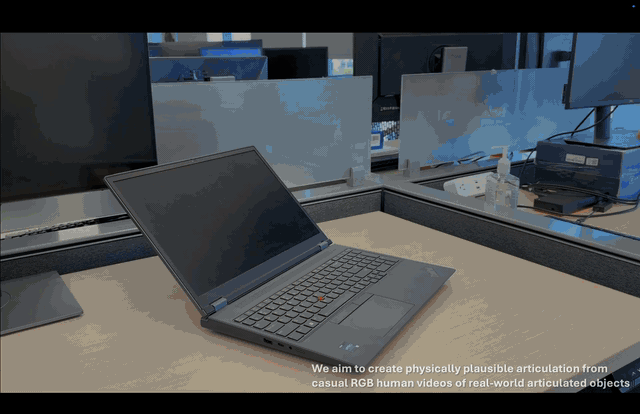

# Track, Articulate, Act

### Generating Articulation from Casual Human Videos

**Jiaming Zhang and Homanga Bharadhwaj** 
Department of Computer Science, Johns Hopkins University 
Brains, Bots, and Behavior Lab

[**Project website**](https://track-articulate-act.github.io/) · [**Paper**](https://track-articulate-act.github.io/paper.pdf)

## About

A research pipeline for reconstructing articulated objects and their motion
from RGB video frames. It combines depth and camera estimation, part
segmentation, 3D mesh reconstruction, joint estimation, and hand tracking to
build scenes for analysis and MuJoCo interaction experiments.

## Pipeline

| Stages | Purpose |
| --- | --- |
| `00–02` | Estimate depth and cameras with DA3; select prompts and segment parts with SAM3. |
| `03–06` | Reconstruct with SAM 3D Objects, scale meshes, segment them with SegviGen, and register static geometry. |
| `07–11` | Estimate joints from registered meshes, video, or TrackCraft3R point tracks; optionally align per-label meshes. |
| `12–14` | Track hands with HaWoR, scale them into the scene, and test hand-driven articulation in MuJoCo. |

Inputs live in `data/<scene>/frames/`. Each stage writes its results under the
same scene directory. Scripts in [`scripts/`](scripts/) are numbered `00`–`14`;
run the stages needed for your workflow in ascending order. Joint-estimation
methods are alternatives, so every workflow does not require every stage.

## Getting started

1. Follow the [environment setup guide](doc/ENVIRONMENT_SETUP_GUIDE.md) to install
   the required models and checkpoints in their respective environments.
2. Follow the [quickstart](doc/QUICKSTART.md) for frame preparation, prompts,
   and commands for the current stages. Run commands from the repository root.
3. Consult the [comprehensive guide](doc/COMPREHENSIVE.md) for stage inputs and
   outputs, current options, compatibility requirements, and troubleshooting.

The quickstart identifies stage-specific compatibility requirements and missing
legacy helpers. Model inference requires the relevant GPU dependencies.

## Repository layout

- [`scripts/`](scripts/) — numbered pipeline entry points.
- [`articulation_estimation/`](articulation_estimation/) — video-based joint fitting and supporting geometry utilities.
- [`doc/`](doc/) — setup, quickstart, and comprehensive documentation.
